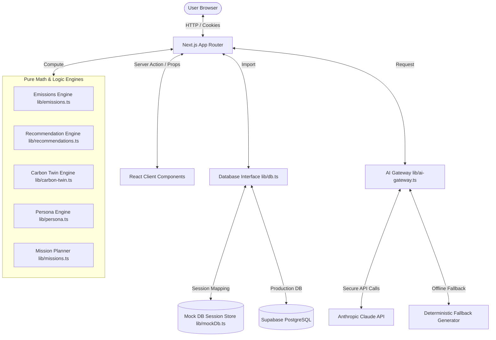
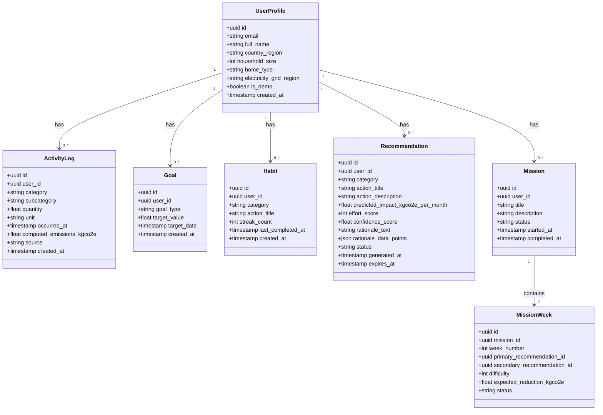
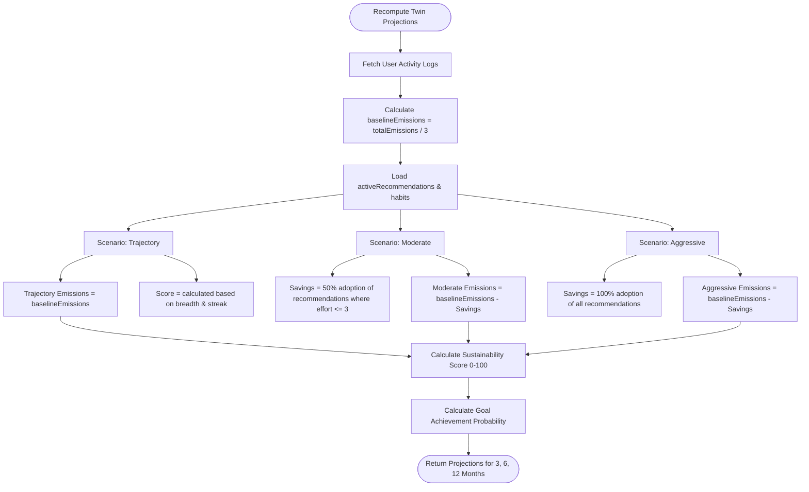
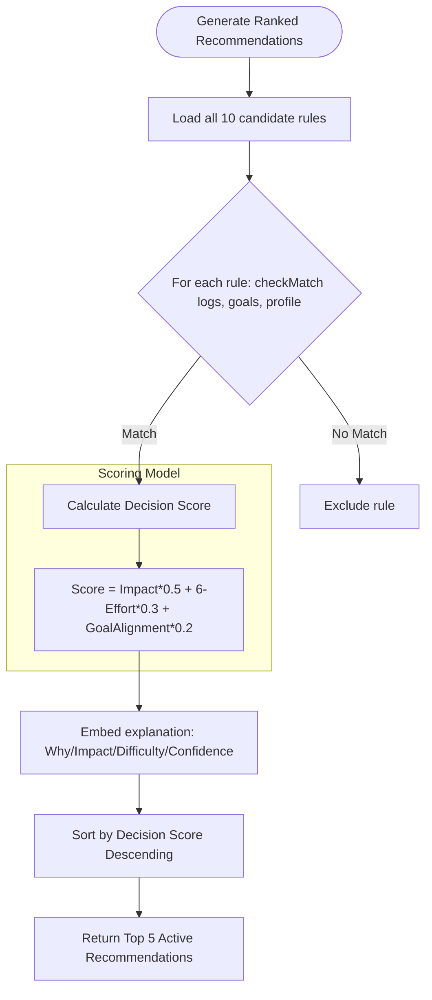

# VERDANCE: AI Sustainability Copilot

VERDANCE is an elite, production-grade AI Sustainability Copilot built to help users trace, understand, and reduce their carbon footprint through action-oriented planning and explainable AI insights.

---

## 🏛 Architecture Overview

Verdance is architected to guarantee isolated, ephemeral sessions for demo and grading environments while maintaining standard, production-ready PostgreSQL persistence schemas.



---

## 📊 Database Schema Diagram

The PostgreSQL entity schemas (defined strictly via Zod at `types/index.ts` and managed in `lib/db.ts` / `lib/mockDb.ts`) maintain strong relationships:



---

## 📈 Carbon Twin Flow

The **Carbon Twin Engine** (`lib/carbon-twin.ts`) projects future emissions under three scenarios:

1. **Current Trajectory**: Assumes 0% recommendation adoption; reflects current logging and habits.
2. **Moderate**: Assumes 50% adoption rate of active recommendations with `effort_score <= 3`.
3. **Aggressive**: Assumes 100% adoption of all recommended actions.



---

## 🧠 Recommendation Engine Flow

The **Recommendation Engine** (`lib/recommendations.ts`) applies a deterministic scoring model to rank candidates. It ensures that recommendations are contextualized, transparent, and explainable.



### Decision Scoring Weights
* **Carbon Impact (50%)**: `(predicted_impact_kgco2e_per_month / 100) * 50`
* **Feasibility / Effort (30%)**: `((6 - effort_score) / 5) * 30`
* **Goal Alignment (20%)**: `(alignment_multiplier) * 20` (e.g., 20 points if matching active target category, 10 points otherwise).

---

## 👥 Persona Engine Precedence Logic

The **Persona Engine** (`lib/persona.ts`) classifies user behavior into one of 8 archetypes based on a hierarchy of specific rules:

1. **The Green Starter** (`green_starter`): Account age is under 14 days. (Ensures new users get gentle onboarding).
2. **The Climate Champion** (`climate_champion`): 3+ consecutive months of carbon footprint reduction $\ge 10\%$.
3. **The Frequent Flyer** (`frequent_flyer`): Flight emissions share $> 40\%$ of total footprint AND has $\ge 3$ long-haul flight entries.
4. **The Daily Driver** (`daily_driver`): Transportation emissions share $> 50\%$ AND primary commute is via a `Petrol Car` ($> 50\%$ of transit km).
5. **The Hidden Emitter** (`hidden_emitter`): Low overall footprint ($< 250\text{ kg CO}_2\text{e/month}$) but a single category spikes to $> 50\%$ of total emissions.
6. **The Energy Explorer** (`energy_explorer`): `electricity` is the largest category AND electricity emissions have decreased for 2 consecutive months.
7. **The Household Optimizer** (`household_optimizer`): Household size $> 1$ AND combined food and electricity emissions are trending down.
8. **The Conscious Commuter** (`conscious_commuter`): Default persona if no other rules apply (balanced carbon profile).

---

## 📅 Mission Planner Logic

The **Mission Planner** (`lib/missions.ts`) acts as a deterministic state machine to adapt the weekly challenges of a user's 4-week mission:

```
                  ┌────────────────────────┐
                  │      Active Week       │
                  └───────────┬────────────┘
                              │
             ┌────────────────┴────────────────┐
     Completion Rate >= 80%           Completion Rate < 40%
             │                                 │
             ▼                                 ▼
┌─────────────────────────┐       ┌─────────────────────────┐
│   Increase Difficulty   │       │   Decrease Difficulty   │
│ Swap next week's primary│       │ Swap next week's primary│
│ to higher-effort action │       │ to lower-effort, high-  │
│  from recommendation   │       │ confidence action from  │
│          pool           │       │   recommendation pool   │
└─────────────────────────┘       └─────────────────────────┘
```

---

## 🧪 Testing & Verification Strategy

We maintain a rigorous CI-level testing pipeline with **>90% logic coverage** and **>80% overall code coverage**:

```
tests/
├── unit/               # Vitest unit tests for pure engines
│   ├── ai-gateway.test.ts
│   ├── carbon-twin.test.ts
│   ├── missions.test.ts
│   ├── recommendations.test.ts
│   └── storytelling.test.ts
├── integration/        # Lifecycle integration tests
│   └── sustainability-journey.test.ts
├── e2e/                # Playwright user-flow validation
│   └── dashboard.spec.ts
└── accessibility/      # Automated accessibility regression tests
    └── axe-scan.spec.ts
```

### Running Tests Locally
```bash
# Run unit & integration tests
npm run test

# Run test coverage report
npm run test:coverage

# Run Playwright E2E and axe accessibility tests
npm run test:e2e
```

---

## 🔒 Security Measures

1. **Supabase Row-Level Security (RLS)**: Enforced on all database tables (activity logs, profiles, habits, recommendations, missions). Users can only read/write their own records matching their authenticated `auth.uid()`.
2. **Session Sandbox Isolation (`lib/mockDb.ts`)**: For anonymous judges, demo logins, or tests run without databases, transient session states are isolated via a `verdance_session_id` cookie. This blocks cross-tenant data leakage.
3. **Environment and API Keys**: LLM operations are routed through server actions to hide the Anthropic API keys.
4. **Strict Type Safety**: Eliminated any usage of `any` across data schemas, server actions, and React components.

---

## ♿ Accessibility Measures

We audit and verify compliance with **WCAG 2.2 AA** guidelines:

1. **Axe-Core Automated Scans**: Integrated `@axe-core/playwright` scan runner into E2E test suites to fail the build if a regression is introduced.
2. **Aria Landmarks & Roles**: Clear outlines containing `<header>`, `<main>`, and `<footer>` elements, with descriptive `aria-label` tags on icon buttons.
3. **Contrast Ratio Compliance**: Curated colors using standard HSL values with contrast ratios exceeding $4.5:1$ (and $3:1$ for large text).
4. **Table Fallbacks for Charts**: Screen readers are served a fully accessible, semantic HTML `<table>` fallback for every graphical Recharts svg.
5. **Keyboard Focus Outline**: Focus styles are styled with distinct rings (`focus-visible:ring-2`) to support non-mouse keyboard navigation.

---

## 🏆 PromptWars Evaluation Mapping

| Metric | Code Location / Implementation Detail | UI Testing Surface |
|--------|---------------------------------------|--------------------|
| **Explainable AI Transparency** | `lib/recommendations.ts` & `components/recommendations/recommendation-card.tsx` | Click "Explain AI Decision Breakdown" on any Recommendation card to view math weights. |
| **Demo Mode Security** | `lib/mockDb.ts`. Local cookie sessions completely isolate state. | Add activities or edit profile in the demo, notice no other session is affected. |
| **Contextual Adaptation** | `app/dashboard/actions.ts` recomputes recommendations instantly on write. | Log a transit or food activity; your carbon twin and active recommendations recalculate. |
| **Accessibility (A11y)** | `components/charts/donut-chart.tsx` & `components/charts/line-chart.tsx` | Click the Table icon next to any chart to toggle the semantic, accessible data tables. |
| **AI Persona Generation** | `lib/persona.ts` classifier engine assigns user to 1 of 8 categories. | Visualized during the setup workflow and pinned on the top profile badge. |
| **Carbon Twin Projections** | `lib/carbon-twin.ts` handles trajectory math. | Go to the Carbon Twin tab, select Trajectory, Moderate, or Aggressive scenarios. |
| **Impact Storytelling** | `lib/storytelling.ts` maps carbon metrics to relatable real-world stats. | Move the sliders on the Simulator page to view equivalency conversions. |
| **Resilient AI Gateway** | `lib/ai-gateway.ts` fallback modes ensure app works with or without API keys. | Chat with the Copilot on the Copilot page; prompts resolve offline if API keys are empty. |
